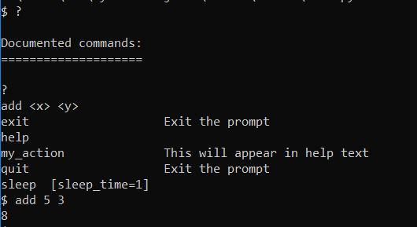
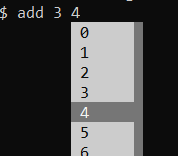

# aiocmd
Coroutine-based CLI generator using prompt_toolkit, similarly to the built-in cmd module.

## How to install?
Simply use `pip3 install aiocmd`

## How to use?
To use, inherit from the `PromptToolkitCmd` class and implement the `do_<action>` for each command.

Each command can receive arguments and optional (keyword) arguments. You then must run the `run()` coroutine to start the CLI.

For instance:
```python
import asyncio

from aiocmd import aiocmd


class MyCLI(aiocmd.PromptToolkitCmd):

    def do_my_action(self):
        """This will appear in help text"""
        print("You ran my action!")
        
    def do_add(self, x, y):
        print(int(x) + int(y))

    async def do_sleep(self, sleep_time=1):
        await asyncio.sleep(int(sleep_time))
        
        
if __name__ == "__main__":
    asyncio.get_event_loop().run_until_complete(MyCLI().run())
``` 

Will create this CLI:



## Extra features

You can implement a custom completion for each command by implementing `_<action>_completions`. 

For example, to complete a single-digit number for the `add` action:

```python
class MyCLI(aiocmd.PromptToolkitCmd):
    
    def _add_completions(self):
        return WordCompleter([str(i) for i in range(9)])
```



You can also set a custom `prompt` and `aliases` parameters for the class (example in docs).
